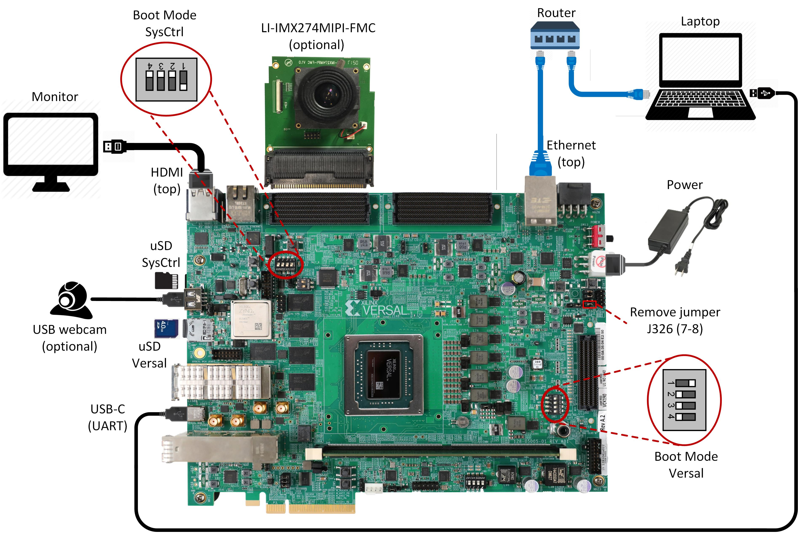
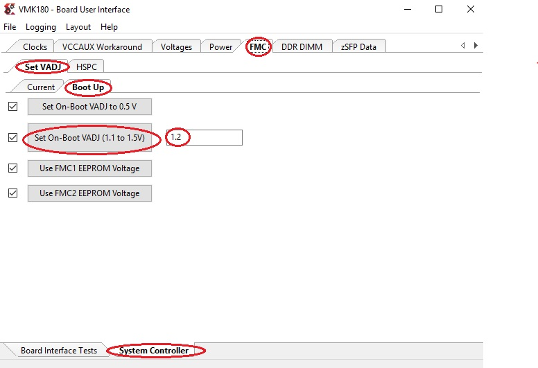
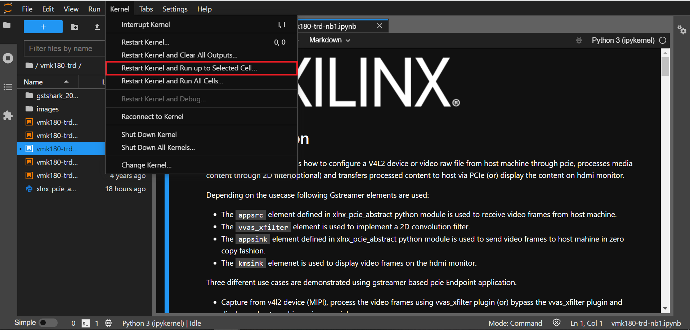

<table class="sphinxhide">
 <tr>
   <td align="center"><h1> Versal Prime -VMK180 Evaluation Kit Multimedia TRD Tutorial</h1>
   </td>
 </tr>
 <tr>
 <td align="center"><h1>Setting up the Board and Application Deployment</h1>

 </td>
 </tr>
</table>

Setting up the Board and Application Deployment
===============================================

Introduction
------------

This document shows how to set up the board and run the VMK180 TRD application.

Setting up the Board
------------------------

### Flash the SD Card
  * Download  the `vmk180_multimedia_trd_prebuilt_2021.1.zip` package, unzip and save it on your computer. Alternatively, Go through tutorials section to build `petalinux-sdimage.wic` locally.
  
  * To uncompress wic file use following command 

	```
	cd vmk180_multimedia_trd_prebuilt_2021.2
	xz -d -v petalinux-sdimage.wic.xz
	```

	This generates a output file named
	`petalinux-sdimage.wic`.
  
  * Connect the microSD to your computer.

  * Download the [Balena Etcher tool](https://www.balena.io/etcher/) (recommended; available for Window, Linux, and 
  macOS) required to flash the SD card.

  * Follow the instructions in the tool and select the downloaded image to flash onto your microSD card. 

    

  * Eject the SD card from your computer.

    If you are looking for other OS specific tools to write the image to the SD card refer to [Setting up the SD Card Image](https://www.xilinx.com/products/som/kria/kv260-vision-starter-kit/kv260-getting-started/setting-up-the-sd-card-image.html)

### Hardware Setup:

Below diagram shows Board and hardware connections.




   
  * **Board jumper and switch settings**
  
	This is a onetime setup and the board should have been delivered to you with this default settings, but it is good to double check for the first time when you get the board.

   * Make sure you remove J326 (7-8) jumper.
   * Setup SYSCTRL Boot mode switch SW11 to (ON,OFF,OFF,OFF) from switch bits 1 to 4 as shown in the above picture.
   * Setup Versal Boot Mode switch SW1 to (ON,OFF,OFF,OFF) from switch bits 1 to 4 as shown in the above picture.

  * **microSD**: Insert the SD card into slot at Versal microSD slot (top).
  
	Make sure you have the SYSCTRL uSD card inserted in the slot (bottom) and card has the SYSCTRL image. For Latest version of SYSCTRL image, refer to [Beam Tool Wiki Page](https://xilinx-wiki.atlassian.net/wiki/spaces/A/pages/972914749/BEAM+Tool+for+VMK180+Evaluation+Kit )

  * **Monitor** : Before booting, connect a 1080P/4K monitor to the board via either HDMI port. 4K monitor is preferred to demonstrate at the maximum supported resolution.
	
	> **Note**: The design has been validated with Dell Flat panel(U2718Q) & Viewsonic (SS16024) monitors.
	
  * **FMC and Vadj settings**:
    Before power on, install an  Leopard IMX274 MIPI FMC card to the FMCP1 slot (J51) as shown in the above figure.
    Perform the following steps to set the Vadj voltage rail to 1.2V using the BoardUI utility:

	* Download the BoardUI Utility from VMK180 Product Page: [BoardUI/ Board Interface Test](https://www.xilinx.com/support/documentation-navigation/see-all-versions.html?xlnxproducttypes=Boards%20and%20Kits&xlnxdocumentid=XTP623 )
	
	* Extract the zip file and start the BoardUI tool. Make sure the USB-C cable is connected to your PC and the system controller Micro SD card is inserted.
	
	* In the BoardUI GUI, navigate to the FMC Boot Up tab following the red circles as shown in the below figure. Enter 1.2 in the Set On-Boot VADJ field and click the button next to it to save the value.
  
	

   * Power-cycle the board and navigate to the FMC Current tab. Click the Get VADJ_FMC Voltage button to read out the current voltage setting and confirm it matches the 1.2V set in the previous step.
   * Close the BoardUI utility.
  
  > **Note**: For the IMX274 MIPI FMC v1.1, Vadj voltage rail is required to be set to 1.5V instead of 1.2V.

  * **Serial console settings**: VMK180 comes with a USB-C connector for JTAG+UART, when connected three UART ports should be visible in Device Manager:

    * Versal UART0
    * Versal UART1 &
    * System Controller UART

  * Connect a USB-C cable to the USB-UART connector. In the terminal emulator choose Versal UART0 and use the following settings:
  
    * Baud Rate: 115200
    * Data: 8 bit
    * Parity: None
    * Stop: 1 bit
    * Flow Control: None

  * You may also use a USB webcam as an input device.

    The webcam is optional video input device supported in the application. Recommended webcam is the [Logitech BRIO](https://www.logitech.com/en-in/products/webcams/brio-4k-hdr-webcam.960-001105.html).

  * **Network connection**:

    Connect the Ethernet cable to your local network with DHCP enabled to run Jupyter Notebooks

### Power on the board, and boot the Linux image.
   
   Follow these steps to boot the board into Linux:
  * Ensure all steps under the section ‘Board jumper and switch settings’ are verified.
	
  * Insert the prepared micro SD card into the Versal SD card slot (refer to the image VMK180 Board Setup)
	
  * Make physical connections to ethernet, HDMI, UART, webcam and power as shown in the image.
	
  * Turn ON power switch SW13.
	
  * On Versal UART0 terminal, we would see the Versal device booting from the micro SD card starting with the message “Xilinx Versal Platform Loader and Manager”
	
  * In about 60 seconds boot is complete. Observe the Linux prompt root@xilinx-vmk180-es1-2020_2 and autostart of JupyterLab server as shown in the example below:
	

 ```
 root@xilinx-vmk180-2021_1:~#
[W 02:30:21.552 LabApp] JupyterLab server extension not enabled, manually loading...
[I 02:30:21.571 LabApp] JupyterLab extension loaded from /usr/lib/python3.5/site-packages/jupyterlab
[I 02:30:21.572 LabApp] JupyterLab application directory is /usr/share/jupyter/lab
[I 02:30:21.580 LabApp] Serving notebooks from local directory: /usr/share/notebooks
[I 02:30:21.581 LabApp] The Jupyter Notebook is running at:
[I 02:30:21.581 LabApp] http://172.19.1.246:8888/?token=c46d443a39d2648046afdbb9bc5821177ab7cd386c218103
[I 02:30:21.581 LabApp] Use Control-C to stop this server and shut down all kernels (twice to skip confirmation).
[C 02:30:23.092 LabApp]

 To access the notebook, open this file in a browser:
     file:///home/root/.local/share/jupyter/runtime/nbserver-1889-open.html
 Or copy and paste one of these URLs:
     http://172.19.1.246:8888/?token=c46d443a39d2648046afdbb9bc5821177ab7cd386c218103
 ```
   Follow these steps to connect to the jupyter-server using Chrome browser on the laptop.

 > **Note**:  This demo is tested with Chrome browser only.

  * Copy the generated URL with token on the prompt of Versal target and paste it to the browser address bar of the laptop, for example:

```
http://172.19.1.246:8888/?token=c46d443a39d2648046afdbb9bc5821177ab7cd386c218103

```

  > **Note**: If for any reason target fails to grab an IP address from the network, Jupyter server would fail to issue an URL. In such a case user is recommended to fix an IP address and restart the jupyter server as shown below:

```

/etc/init.d/jupyterlab-server stop
/etc/init.d/jupyterlab-server start

```
To look up the jupyter server IP address and token on the target, run:

```
jupyter notebook list

```
Copy the generated URL with token on the prompt of Versal target and paste it to the browser address bar of the laptop, for example:

```

http://192.168.1.77:8888/?token=06cfb958c61eb0581bb759f40e3a4c3a6252cef3b7075449

```

In case of a private network, user may have to assign a static address within the subnet of the host laptop

Run the Application
----------------------

### Run the Jupyter Notebooks

 This TRD includes the following jupyter notebooks:

1. **vmk180-trd-nb3.ipynb**: Demonstrates streaming video from a v4l2 device on the target to a HDMI monitor, with and without 2D filter, using the GStreamer multimedia framework.
2. **vmk180-trd-apm.ipynb**: Demonstrates how to plot the memory bandwidth while a video pipeline is running using the libxapm library with python bindings.
3. **vmk180-trd-cpu.ipynb**: Demonstrates how to plot the CPU usage while running applications and pipelines.
4. **vmk180-trd-power.ipynb**: Demonstrates how to plot power consumption of multiple voltage rails throughout the board.


  
to run the notebooks, follow the below steps:

1. On the left pane of the browser, 8 notebooks are available under the folder VMK180 TRD.
2. Double click to open the notebook
3. Select ‘Kernel’ → ‘Restart Kernel and Run All Cells’ (This will reset kernel and run's all cells sequentially) from the top menu bar to run the demo. Scroll down to the end of the notebook to see the video output.

 

4. Click the rectangular icon to interrupt the kernel and stop the video stream.

 

5. Select ‘Kernel’ → ‘Shutdown Kernel’ → close the notebook tab and move to the next notebook.

> **NOTE** : Please follow ''step 3 to step 5'', without this you may observe incorrect behavior while moving to different notebook. 

**Next Steps**
* Go back to the [VMK180 Multimedia TRD design start page](../platform1_landing.md)

**License**

Licensed under the Apache License, Version 2.0 (the "License"); you may not use this file except in compliance with the License.

You may obtain a copy of the License at
[http://www.apache.org/licenses/LICENSE-2.0](http://www.apache.org/licenses/LICENSE-2.0)

Unless required by applicable law or agreed to in writing, software distributed under the License is distributed on an "AS IS" BASIS, WITHOUT WARRANTIES OR CONDITIONS OF ANY KIND, either express or implied. See the License for the specific language governing permissions and limitations under the License.

<p align="center">Copyright&copy; 2021 Xilinx</p>
