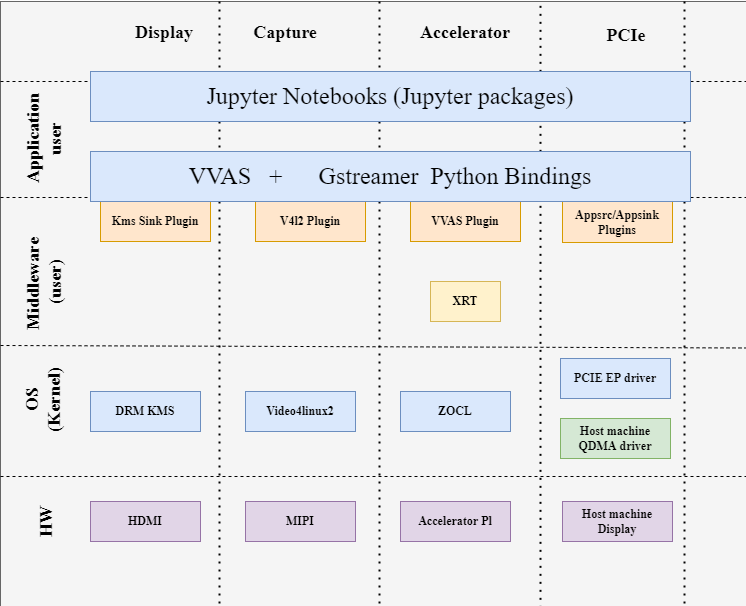
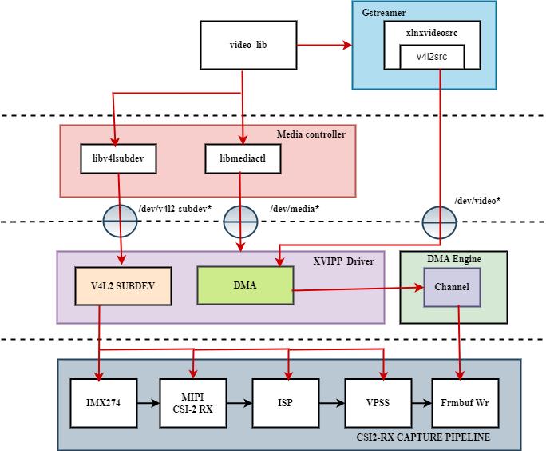
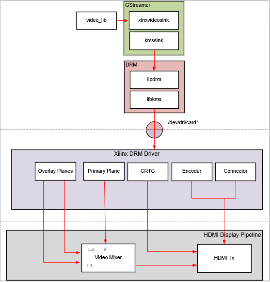
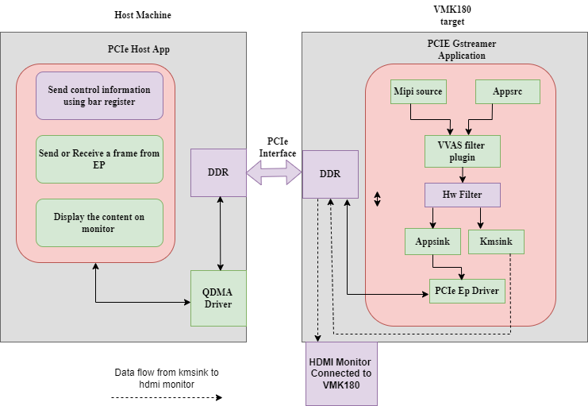
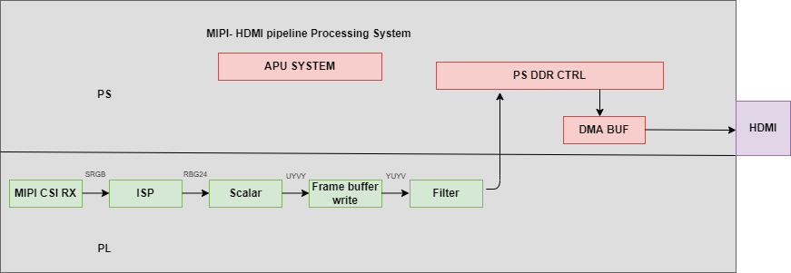
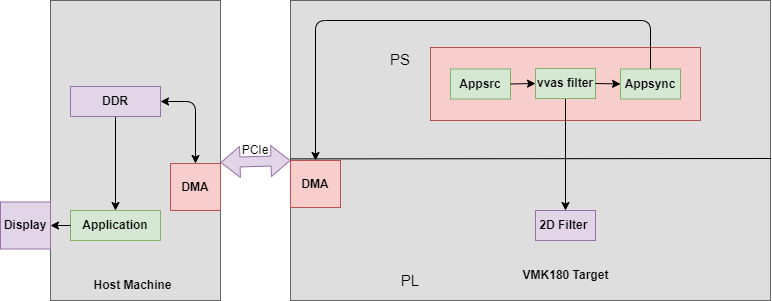

<table class="sphinxhide">
 <tr>
   <td align="center"><h1> Versal Prime -VMK180 Evaluation Kit TRD Tutorial</h1>
   </td>
 </tr>
 <tr>
 <td align="center"><h1> Software Architecture of the Platform </h1>

 </td>
 </tr>
</table>

Software Architecture of the Platform
======================================

# Introduction

In this document it describes the Linux software stack,PS application running on the endpoint receives control information using the PCIe BAR map memory and data flow to and fro to the host machine through the QDMA drivers. 2dfilter accelerator in the PL receives this data, processes it and sends processed content back to the host.

# Software Stack

The  software stack of VMK180 endpoint device and x86 host is shown in the following figures.

## Endpoint software stack

### The Endpoint software stack is horizontally divided into the following layers:

* Application layer (user-space)
	- G-streamer/Jupyter notebooks with a simple control and visualization interface     
	- GStreamer multimedia framework with python bindings for video pipeline control(MIPI → Filtered → HDMI)   
	- Gstreamer based application to capture data from MIPI on endpoint, process and transfer to host machine via pcie and display on HOST machine.
	- Gstreamer based application to receive data host machine, process the data on EP and transfer to host machine via pcie and display on HOST 		  machine
* Middleware layer (user-space)
	- Implements and exposes domain-specific functionality by means of GStreamer plugins to interface with the application layer
	- Provides access to kernel frameworks
* Operating system (OS) layer (kernel-space)
	- Provides a stable, well-defined API to user-space
 	- Includes device drivers and kernel frameworks (subsystems)
	- Access to hardware IPs

### Vertically, the Endpoint software components are divided by domain :

#### Video Capture :

The Video Capture software stack is depicted in the following figure using the single-sensor MIPI CSI capture pipeline as an example

At a high level it consists of the following layers from top to bottom:

* User-space layers

	- GStreamer: Media source bin plugin (wrapper around generic v4l2src plugin)
	- Media controller: Library to configure v4l subdevices and media devices

* Kernel-space layers
	- V4L2/Media subsystems: Xilinx video IP pipeline (XVIPP) driver
	- DMA engine: Xilinx framebuffer driver

#### Kernel Subsystems

In order to model and control video capture pipelines such as the ones used in this TRD on Linux systems, multiple kernel frameworks and APIs are required to work in concert. For simplicity, we refer to the overall solution as Video4Linux (V4L2) although the framework only provides part of the required functionality. The individual components are discussed in the following sections.

#### Driver Architecture

The Video Capture Software Stack figure in the Capture section shows how the generic V4L2 driver model of a video pipeline is mapped to the single-sensor MIPI CSI-2 Rx capture pipelines. The video pipeline driver loads the necessary sub-device drivers and registers the device nodes it needs, based on the video pipeline configuration specified in the device tree. The framework exposes the following device node types to user space to control certain aspects of the pipeline:

	- Media device node: /dev/media*
	- Video device node: /dev/video*
	- V4L2 sub-device node: /dev/v4l-subdev*

#### Media Framework

The main goal of the media framework is to discover the device topology of a video pipeline and to configure it at run-time. To achieve this, pipelines are modeled as an oriented graph of building blocks called entities connected through pads. An entity is a basic media hardware building block. It can correspond to a large variety of blocks such as physical hardware devices (e.g. image sensors), logical hardware devices (e.g. soft IP cores inside the PL), DMA channels or physical connectors. Physical or logical devices are modeled as sub-device nodes and DMA channels as video nodes. A pad is a connection endpoint through which an entity can interact with other entities. Data produced by an entity flows from the entity's output to one or more entity inputs. A link is a point-to-point oriented connection between two pads, either on the same entity or on different entities. Data flows from a source pad to a sink pad. A media device node is created that allows the user space application to configure the video pipeline and its sub-devices through the libmediactl and libv4l2subdev libraries. The media controller API provides the following functionality:

	- Enumerate entities, pads and links
	- Configure pads
		- Set media bus format
		- Set dimensions (width/height)
	- Configure links
	- Enable/disable
	- Validate formats

 The following figures show the media graphs for MIPI CSI-2 Rx video capture pipeline as generated by the media-ctl utility. The subdevices are shown in green with their corresponding control interface base address and subdevice node in the center. The numbers on the edges are pads and the solid arrows represent active links. The yellow boxes are video nodes that correspond to DMA channels, in this case write channels (outputs).

#### Video IP Drivers

Xilinx adopted the V4L2 framework for most of its video IP portfolio. The currently supported video IPs and corresponding drivers are listed under V4L2. Each V4L driver has a sub-page that lists driver-specific details and provides pointers to additional documentation. The following table provides a quick overview of the drivers used in this design. V4L2 Drivers Used in Capture Pipelines.

| Linux Driver          		 | Function |
| :-----------------------------:|:-------- |
| Xilinx Video Pipeline (XVIPP)   | - Configures video pipeline and register media, video and sub-device nodes.    - Configures all entities in the pipeline and validate links.   	- Configures and controls DMA engines (Xilinx Video Framebuffer Write).   	- Starts/stops video stream. |
| MIPI CSI-2 Rx 				 | - Sets media bus format and resolution on input pad.  	- Sets media bus format and resolution on output pad. |
| IMX274 sensor   | - Sets the media bus format and resolution for the sensor Input pad.   - Set the media bus format and resolution for output pads.|

#### HDMI Tx Display

Linux kernel and user-space frameworks for display and graphics are intertwined and the software stack can be quite complex with many layers and different standards / APIs. On the kernel side, the display and graphics portions are split with each having their own APIs. However, both are commonly referred to as a single framework, namely DRM/KMS. This split is advantageous, especially for SoCs that often have dedicated hardware blocks for display and graphics. The display pipeline driver responsible for interfacing with the display uses the kernel mode setting (KMS) API and the GPU responsible for drawing objects into memory uses the direct rendering manager (DRM) API. Both APIs are accessed from user-space through a single device node.

#### Direct Rendering Manager

This section focuses on the common infrastructure portion around memory allocation and management that is shared with the KMS API.

#### Driver Features

The Xilinx DRM driver uses the GEM memory manager, and implements DRM PRIME buffer sharing. PRIME is the cross device buffer sharing framework in DRM. To user-space PRIME buffers are DMABUF-based file descriptors. The DRM GEM/CMA helpers use the CMA allocator as a means to provide buffer objects that are physically contiguous in memory. This is useful for display drivers that are unable to map scattered buffers via an IOMMU. Frame buffers are abstract memory objects that provide a source of pixels to scan out to a CRTC. Applications explicitly request the creation of frame buffers through the DRM_IOCTL_MODE_ADDFB(2) ioctls and receive an opaque handle that can be passed to the KMS CRTC control, plane configuration and page flip functions

#### Kernel Mode Setting

Mode setting is an operation that sets the display mode including video resolution and refresh rate. It was traditionally done in user-space by the X-server which caused a number of issues due to accessing low-level hardware from user-space which, if done wrong, can lead to system instabilities. The mode setting API was added to the kernel DRM framework, hence the name kernel mode setting. The KMS API is responsible for handling the frame buffer and planes, setting the mode, and performing page-flips (switching between buffers). The KMS device is modeled as a set of planes, CRTCs, encoders, and connectors as shown in the top half of Figure above. The bottom half of the figure shows how the driver model maps to the physical hardware components inside the PS DP Tx display pipeline.

#### CRTC

CRTC is an antiquated term that stands for cathode ray tube controller, which today would be simply named display controller as CRT monitors have disappeared and many other display types are available. The CRTC is an abstraction that is responsible for composing the frame to be scanned out to the display and setting the mode of the display. In the Xilinx DRM driver, the CRTC is represented by the buffer manager and blender hardware blocks. The frame buffer (primary plane) to be scanned out can be overlayed and/or alpha-blended with a second plane inside the blender. The DP Tx hardware supports up to two planes, one for video and one for graphics. The z-order (foreground or background position) of the planes and the alpha mode (global or pixel-alpha) can be configured through the driver via custom properties.

The pixel formats of the video and graphics planes can be configured individually at run-time and a variety of formats are supported. The default pixel formats for each plane are set statically in the device tree. Pixel unpacking and format conversions are handled by the buffer manager and blender. The DRM driver configures the hardware accordingly so this is transparent to the user.

A page-flip is the operation that configures a plane with the new buffer index to be selected for the next scan-out. The new buffer is prepared while the current buffer is being scanned
out and the flip typically happens during vertical blanking to avoid image tearing.

#### Plane

A plane represents an image source that can be blended with or overlayed on top of a CRTC frame buffer during the scan-out process. Planes are associated with a frame buffer to
optionally crop a portion of the image memory (source) and scale it to a destination size. The DP Tx display pipeline does not support cropping or scaling, therefore both video and graphics plane dimensions have to match the CRTC mode (i.e., the resolution set on the display). The Xilinx DRM driver supports the universal plane feature, therefore the primary plane and overlay planes can be configured through the same API. The primary plane on the video mixer is configurable and set to the top-most plane to match the DP Tx pipeline.
As planes are modeled inside KMS, the physical hardware device that reads the data from memory is typically a DMA whose driver is implemented using the dmaengine Linux
framework. The DPDMA is a 6-channel DMA engine that supports a (up to) 3-channel video stream, a 1-channel graphics stream and two channels for audio (not used in this design). The video mixer uses built-in AXI mater interfaces to fetch video frames from memory.

#### Encoder

An encoder takes pixel data from a CRTC and converts it to a format suitable for any attached connectors. There are many different display protocols defined, such as HDMI or DisplayPort. The PS display pipeline has a DisplayPort transmitter built in. The encoded video data is then sent to the serial I/O unit (SIOU) which serializes the data using the gigabit transceivers (PS GTRs) before it goes out via the physical DP connector to the display. The PL display pipeline uses a HDMI transmitter which sends the encoded video data to the Video PHY. The Video PHY serializes the data using the GTH transceivers in the PL before it goes out via the HDMI Tx connector.

#### Connector

The connector models the physical interface to the display. Both DisplayPort and HDMI protocols use a query mechanism to receive data about the monitor resolution, and refresh rate by reading the extended display identification data (EDID) (see VESA Standard ) stored inside the monitor. This data can then be used to correctly set the CRTC mode. The DisplayPort support hot-plug events to detect if a cable has been connected or disconnected as well as handling display power management signaling (DPMS) power modes.

#### Libdrm

The framework exposes two device nodes per display pipeline to user space: the /dev/dri/card* device node and an emulated /dev/fb* device node for backward compatibility with the legacy fbdev Linux framework. The latter is not used in this design. libdrm was created to facilitate the interface of user space programs with the DRM subsystem. This library is merely a wrapper that provides a function written in C for every ioctl of the DRM API, as well as constants, structures and other helper elements. The use of libdrm not only avoids exposing the kernel interface directly to user space, but presents the usual advantages of reusing and sharing code between programs.

## Host machine software stack 

### The Host machine software stack is horizontally divided into the following layers

* Application layer (user-space)
	- An opencv based application, which interprets user inputs to endpoint PCIe BAR register.
	- An opencv based GUI is used to display filtered data received from endpoint.
	
* Middleware layer (user-space)
	- Here application uses Qt as a cross-platform framework to display video through opencv.
	- Here application uses GLib to stop usecase-1 by monitoring standard input.

* Operating system (OS) layer (kernel-space)
	- Provides a stable, well-defined API to user-space.
 	- Includes device drivers and kernel frameworks (subsystems).
	- Access to hardware IPs.

### Host machine software components

#### PCIe Host application

#### Application and kernel frameworks

An Application frameworks such as opencv,QT and Glib are used to develop host application along with kernel framework i.e., sys filesystem to expose PCIe regigter space to user application. 

#### QDMA Drivers

QDMA driver on the host machine is used to identify VMK180 device connected to the host machine via PCIe interface and perform data transfer through DMA.

Please refer to below link for more details on QDMA drivers:
https://github.com/Xilinx/dma_ip_drivers/tree/master/QDMA/linux-kernel.

# Communication between x86 machine (Host) and  target

Following diagram captures, all the components involved in achieving different usecases(both from Host and Device perspective) 

* G-streamer plugins :
		Following G-streamer plugins are supported and provided as part of package.

* Appsrc plugin: 
		Appsrc plugin interacts with PCIe EP driver and gets the media content from the Host over PCIe interface.

* Appsync Plugin: 
 		Appsync plugin interacts with PCIe EP driver and sends the media content to the Host over PCIe interface.

* 2dfilter plugin: 
  		2dfilter plugin gets media content from Appsrc, passes it through PL filter and sends filtered content to Appsync.

* SDXFilter2d: 
		SDX filter2d plugin is used to configure 2dfilter in PL

* pcie_lib: 
		This library provides abstract APIs for pcie_transcode applications that interact with PCIe user space configuration. 

* pcie_ep_driver: 
		EP driver is used to communicate with the Host using dedicated BAR. It registers DMA read and DMA write interrupts and sends acknowledgement to Host 			accordingly. 

## Details on Data and control information Flow

### At x86 Host machine :  

Data is transferred between the host and the target using the QDMA. QDMA device drivers are installed on the host, are used to configure the QDMA IP on the endpoint and to initiate data transfer from the host. The host reads the media file from the disk, sends control information to the endpoint, also sends the media file to the endpoint using DMA. After receiving filtered output back from the endpoint, the data is displayed on the host monitor. At the device side, the OpenCL-based application is used to receive the data, filter it, and send the data back to the host.

A dedicated BAR is used to send control information between Host and the Device and vice-versa.

### At Endpoint :

In the device, there is an Gstreamer based application which loads the xclbin file using XRT and gets control information with the help of EP pcie driver. Depending on the control information, setups corresponding usecase, using DMA-BUF mechanism does ZERO copy between the GST plugins and transfers data back to the Host. . To achieve better performance instead of buffer copy, endpoint drivers uses DMA-BUF framework available in the linux kernel. With the help of DMA-BUF framework zero copy is achieved by just transferring buffer handles between different SW components.

# Supported Use cases:

Following use cases are supported in this release.

1. MIPI --> 2D Image Processing --> HDMI

2. MIPI --> 2D Image Processing --> PCIE/QDMA EP --> PCIE x86 Host(RC) --> Display on Host

3. Raw Video File from Host --> PCIE x86 Host(RC) --> PCIE/QDMA EP --> 2D Image Processing/Bypass --> PCIE/QDMA EP --> PCIE x86 Host(RC) --> Display on Host

## Usecase-1(MIPI --> 2D Image Processing --> HDMI):

Data is captured using MIPI camera, captured frame is fed through Demossaic, Scalar blocks. Captured frame is processed through 2d filter( filter IP created using the Vitis™ flow in the PL)and filtered content is displayed on the Monitor which is connected to the HDMI port. 

DMA-BUF mechanism which is available in Linux is used to achieve Zero-copy between G-streamer plugins and to achieve better performance.

Device application provides user interface to configure  Plan-id and Sync parameters 

## Usecase-2(MIPI --> 2D Image Processing --> PCIE/QDMA EP --> PCIE x86 Host(RC) ):

Data is captured using MIPI camera, processed using Demossaic, Scalar blocks. Captured frame is processed through 2d filter( filter IP created using the Vitis™ flow in the PL)and filtered content is sent to the Host using appsync G-streamer plugin. On the Host data is displayed on the monitor connected to it.

DMA-BUF mechanism which is available in Linux is used to achieve Zero-copy between G-streamer plugins and to achieve better performance.

Host application provides user interface to configure following parameters Height, Width,  Input-format, Kernel-preset, Kernel-mode, Kernel-name, Framerate. Host send all these parameters to the device using the control interface and actual media data is transferred using DMA through PCIe.

Device application provides user interface to configure  Plan-id and Sync parameters 

## Usecase3: (Raw Video File from Host --> PCIE x86 Host(RC) --> PCIE/QDMA EP --> 2D Image Processing/Bypass --> PCIE/QDMA EP --> PCIE x86 Host(RC) --> Display on Host):

Data is captured from the file source, using DMA data is transferred to device. On the device Appsrc G-streamer plugin is used to receive the data which is then fed through 2d filter( filter IP created using the Vitis™ flow in the PL)and filtered content is sent back to the Host using Appsync G-streamer plugin. On the Host data is displayed on the monitor connected to it.

DMA-BUF mechanism which is available in Linux is used to achieve Zero-copy between G-streamer plugins and to achieve better performance.

Host application provides user interface to configure following parameters Height, Width,  Input-format, Kernel-preset, Kernel-mode, Kernel-name, Framerate. Host send all these parameters to the device using the control interface and actual media data is transferred using DMA through PCIe.

Device application provides user interface to configure  Plan-id and Sync parameters 

**Next Steps**

You can choose any of the following next steps:

* Read [Hardware Architecture of the Platform](hw_arch_platform.md) 
* Go back to the [VMK180 TRD start page](../platform1_landing.md)

**License**

Licensed under the Apache License, Version 2.0 (the "License"); you may not use this file except in compliance with the License.

You may obtain a copy of the License at
[http://www.apache.org/licenses/LICENSE-2.0](http://www.apache.org/licenses/LICENSE-2.0)

Unless required by applicable law or agreed to in writing, software distributed under the License is distributed on an "AS IS" BASIS, WITHOUT WARRANTIES OR CONDITIONS OF ANY KIND, either express or implied. See the License for the specific language governing permissions and limitations under the License.

<align="center">Copyright&copy; 2021 Xilinx

